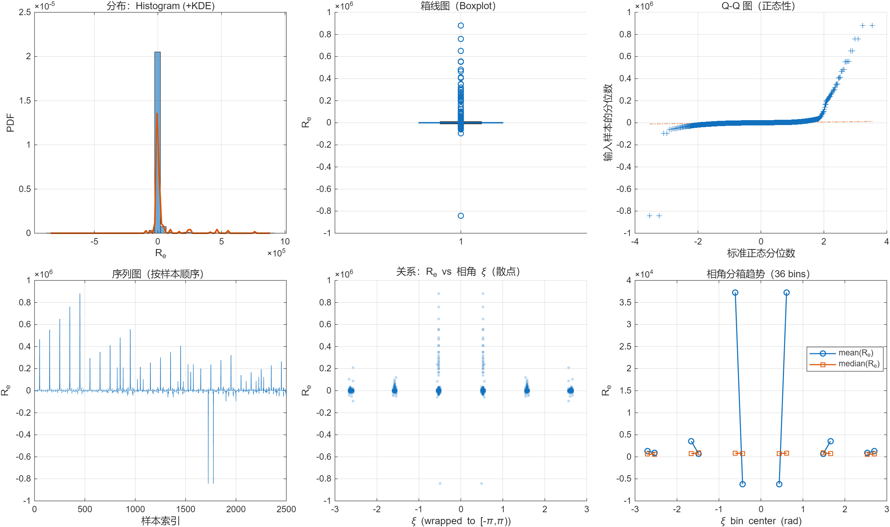
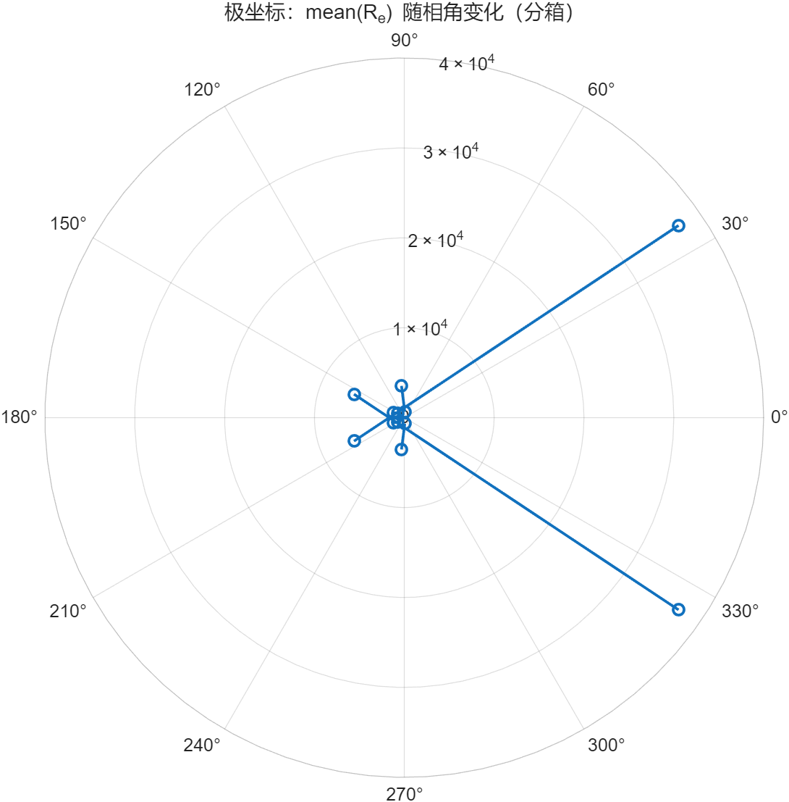
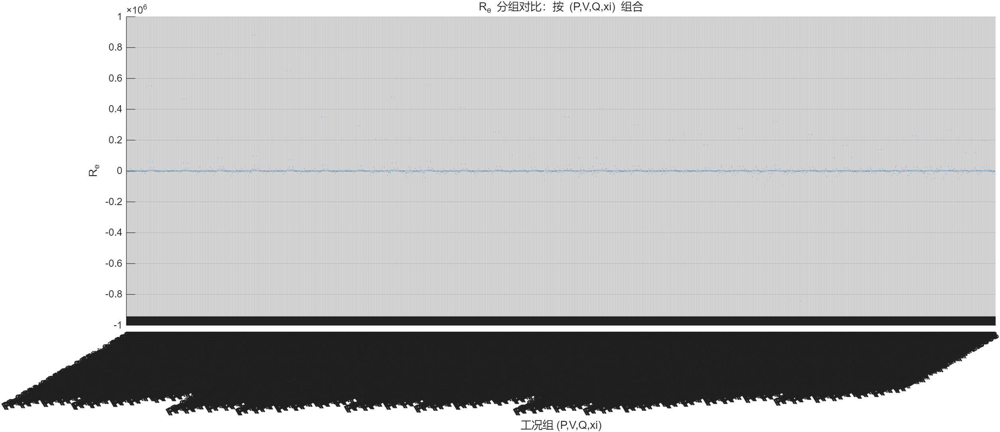
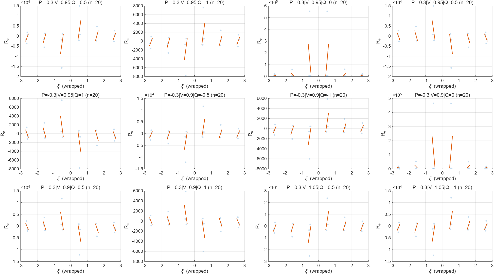
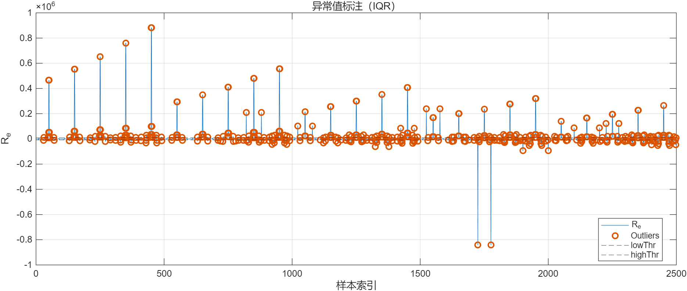
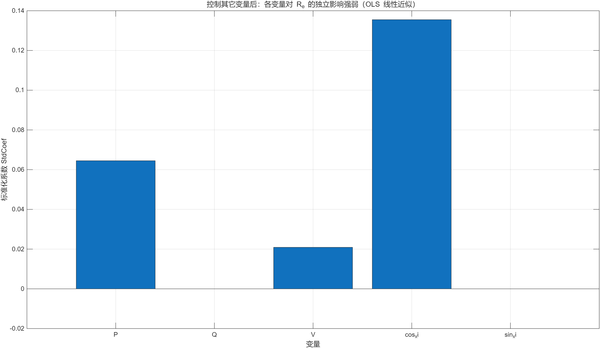
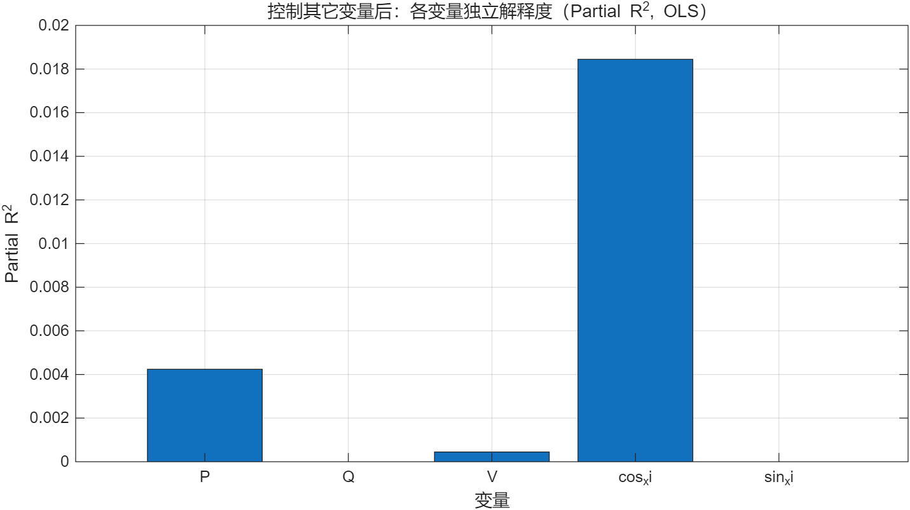
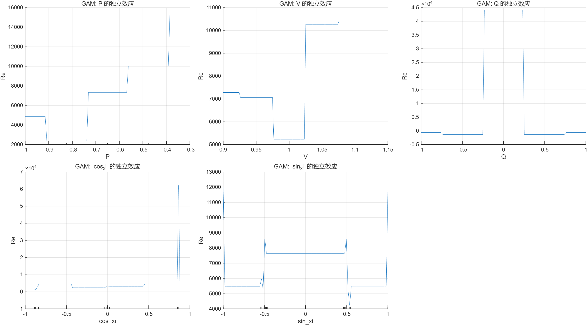

# R_e 数据特征分析报告

- 生成时间：2026-02-17 17:33:49
- 数据文件：`extracted_RL_Series_Y11_wide.csv`
- 样本数：`2500`

## 1. 变量与工况说明

- 工况定义：`(P, V, Q, xi)` 为一组工况。
- `xi`：电网相角（作为周期变量处理，并 wrap 到 `[-π, π)`）。

## 2. R_e 基本统计特征

| 指标 | 数值 |
|---:|---:|
| mean | 8051.33 |
| std  | 64048.4 |
| min  | -841916 |
| 1% quantile | -32039.5 |
| 5% quantile | -12590.4 |
| 25% quantile (Q1) | -1836.24 |
| median | 729.311 |
| 75% quantile (Q3) | 2501.36 |
| 95% quantile | 24413.9 |
| 99% quantile | 300365 |
| max  | 881082 |
| IQR  | 4337.6 |
| skewness | 5.13119 |
| kurtosis | 94.9946 |

## 3. 异常值分析（IQR 规则）

- 阈值：`low = -8342.63`，`high = 9007.75`
- 异常值数量：`476`（占比 `19.04%`）

### 3.1 异常值与稳健建模说明

- 本数据 `R_e` 极值范围很大（min/max 远超 IQR 阈值），异常值占比约 `19.04%`。
- 在异常值比例较高时：
  - 普通最小二乘（OLS）的系数可能被极端点拉偏；
  - 因此本报告同时给出 **稳健回归（Robust Regression）** 作为对照，它会降低异常点权重，使‘独立效应’更稳定。

## 4. 相角 xi（圆统计）与 R_e 的关系

- 圆均值方向 `mu = -3.14159 rad`
- 集中度 `R = 0.0888042`（越接近1越集中）

### 4.1 一阶谐波相关

- corr(`R_e`, cos(xi)) = `0.1355`
- corr(`R_e`, sin(xi)) = `0.0000`

### 4.2 相角分箱趋势

- 分箱数：`36`
- `mean(R_e)` 峰谷差（peak-to-peak）：`43438.3`

## 5. 工况分组差异（按 P,V,Q 分组）

- `(P,V,Q)` 组数量：`125`

### 5.1 样本数最多的 Top 10 组摘要

| Rank | 组 (P,V,Q) | n | mean(R_e) | std(R_e) | median(R_e) |
|---:|---|---:|---:|---:|---:|
| 1 | P=-0.3|V=0.95|Q=-0.5 | 20 | -488.63 | 5525.75 | -608.492 |
| 2 | P=-0.3|V=0.95|Q=-1 | 20 | -110.996 | 2745.67 | -118.565 |
| 3 | P=-0.3|V=0.95|Q=0 | 20 | 66784.4 | 167027 | 5707.95 |
| 4 | P=-0.3|V=0.95|Q=0.5 | 20 | -488.63 | 5525.75 | -608.492 |
| 5 | P=-0.3|V=0.95|Q=1 | 20 | -110.996 | 2745.67 | -118.565 |
| 6 | P=-0.3|V=0.9|Q=-0.5 | 20 | -340.081 | 4266.82 | -412.838 |
| 7 | P=-0.3|V=0.9|Q=-1 | 20 | -78.611 | 2122.66 | -83.3508 |
| 8 | P=-0.3|V=0.9|Q=0 | 20 | 56145.1 | 140417 | 4798.77 |
| 9 | P=-0.3|V=0.9|Q=0.5 | 20 | -340.081 | 4266.82 | -412.838 |
| 10 | P=-0.3|V=0.9|Q=1 | 20 | -78.611 | 2122.66 | -83.3508 |

## 6. 四变量独立效应分析（控制其它变量后）

模型：`R_e ~ P + V + Q + cos(xi) + sin(xi)`（xi 用 cos/sin 表达周期性，避免角度断点）

- OLS 模型 R² = `0.0230`，Adjusted R² = `0.0210`

| 变量 | Coef | StdCoef | p-value | PartialR2 |
|---|---:|---:|---:|---:|
| cos_xi | 12087.7 | 0.135511 | 9.5e-12 | 0.0184479 |
| P | 16686.7 | 0.0644915 | 0.00114 | 0.00423885 |
| V | 18928.4 | 0.0209015 | 0.291 | 0.000446938 |
| sin_xi | 8.65706e-05 | 9.33468e-10 | 1 | 1.95e-16 |
| Q | -0.000146583 | -1.61863e-09 | 1 | 0 |

### 6.1 解读建议

- `StdCoef` 绝对值越大，表示在**线性近似**下独立影响越强。
- `PartialR2` 越大，表示该变量在控制其它变量后能独立解释更多 `R_e` 方差。
- `p-value < 0.05` 常用作统计显著的经验阈值（需结合工程意义解释）。

### 6.2 稳健回归对照（robustfit）

| Term | Coef | p-value |
|---|---:|---:|
| Intercept | -3638.43 | 0.131 |
| P | -927.376 | 0.17 |
| V | 3484.1 | 0.141 |
| Q | 1.80064e-09 | 1 |
| cos_xi | 64.0776 | 0.783 |
| sin_xi | -9.48121e-10 | 1 |

- 若稳健回归与 OLS 在系数符号/显著性上差异明显，说明 OLS 可能受到异常值影响，建议以稳健结果为主。

### 6.3 非线性独立效应（GAM）

- 已拟合 GAM 并输出各变量的 partial dependence 曲线（用于观察非线性独立效应形状）。

## 7. 结论要点（自动生成）

- 异常值比例偏高，建议检查数据来源或采用稳健建模/异常点处理。
- R_e 与相角存在较明显关联（可能有周期成分）；建议分 (P,V,Q) 工况做谐波/傅里叶回归量化幅值与相位。
- 分布偏态较明显，必要时可考虑对 R_e 做变换（log/Box-Cox）或使用分位数/非参数方法。

## 8. 图表（自动导出）

### 图 1

### 图 2

### 图 3

### 图 4

### 图 5

### 图 6

### 图 7

### 图 8

---
报告文件已保存为：`R_e_feature_report.md`
